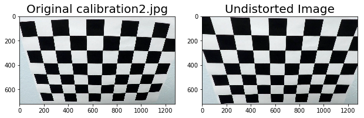
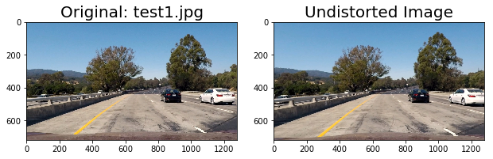
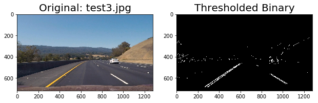
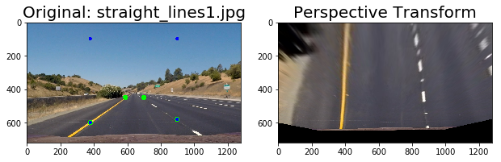
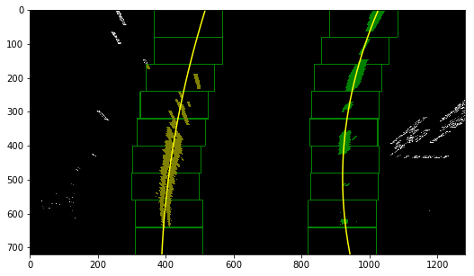
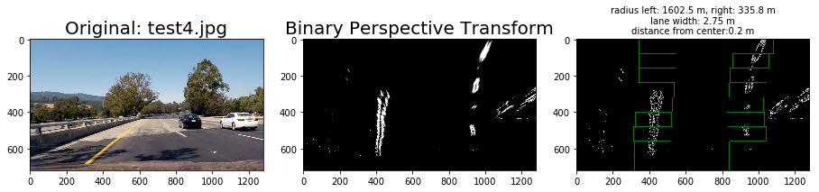
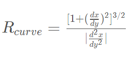
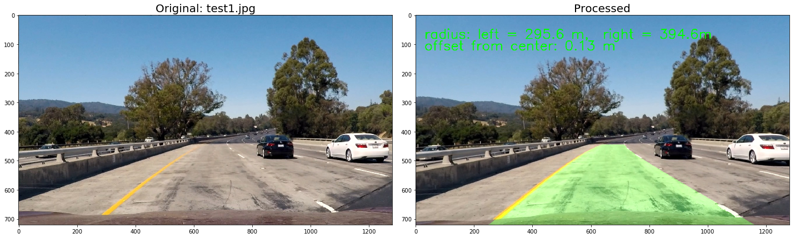

# **Self Driving: Advanced Lane Finding**

The goals / steps of this project are the following:

* Compute the camera calibration matrix and distortion coefficients given a set of chessboard images.
* Apply a distortion correction to raw images.
* Use color transforms, gradients, etc., to create a thresholded binary image.
* Apply a perspective transform to rectify binary image ("birds-eye view").
* Detect lane pixels and fit to find the lane boundary.
* Determine the curvature of the lane and vehicle position with respect to center.
* Warp the detected lane boundaries back onto the original image.
* Output visual display of the lane boundaries and numerical estimation of lane curvature and vehicle position.


**NOTE:** All code mentioned below can be found in this [Jupyter notebook](./FlowSetup.ipynb).

## Camera Calibration

The code for this step is contained in the code cell of *Camera Calibration Using Chessboard Images*. 

I start by preparing "object points", which will be the (x, y, z) coordinates of the chessboard corners in the world. Here I am assuming the chessboard is fixed on the (x, y) plane at z=0, such that the object points are the same for each calibration image.  Thus, `objp` is just a replicated array of coordinates, and `objpoints` will be appended with a copy of it every time I successfully detect all chessboard corners in a test image in the [camera_cal](./camera_cal) folder.  `imgpoints` will be appended with the (x, y) pixel position of each of the corners in the image plane with each successful chessboard detection.  

I then used the output `objpoints` and `imgpoints` to compute the camera calibration and distortion coefficients using the `cv2.calibrateCamera()` function.  I applied this distortion correction to the test image using the `cv2.undistort()` function warped inside the `cal_undistort()` function. and obtained the result as shown below: 



## Pipeline (single images)

####1.Image Distortion Correction.
Distortion correction is applied to the test images using the same method of the camera calibration part. A example is shown as below:  



####2.Thresholded Binary Image Creation.
Thresholded binary image was generated for later lane line finding(code cell *Thresholded Binary Image Creation* in the [Jupyter notebook](./FlowSetup.ipynb)). After some experiment, the original image was transformed into HLS color space, and the gradient along X direction with threshold of (20, 255) in S channel and the magnitude in L channel with threshold of (60, 255) were combined to create the binary image.   Here's an example of the output for this step.  




####3. Perspective Transformation.

The code for perspective transform appeared in the  *Perspective Transform* code cell in the [Jupyter notebook](./FlowSetup.ipynb).  The `lane_line_perspective_transform()` function takes as inputs an image (`image`), as well as source (`src`) and destination (`dst`) points. the source and destination points hard-code as shown below:

```
  
    SRC = np.float32([
        [590, 450],
        [700, 450],
        [380, 600],
        [900, 580]

    ])

    DST = np.float32([
        [360, 0],
        [920, 0],
        [380, 600],
        [900, 580]
    ])

```

And below is a example of the perspective transformation. In the image on the left, the source points is marked as green dot and the destination points is marked as blue dot. The image on the right is the transformed result. Then  



####4. Detect Lane Pixels and Fit to Find the Lane Boundary
After distortion correction, thresholded binary image creation and perspective transformation, a "bird-eye" view binary image is prepared.Then a histogram of pixel value along the X-axis of the bottom half image. The underlying assumption is that the two peaks on the left half and the right half are the center of lane lines. Then  I used the sliding windows method to identify the lane line pixel's coordinates. Then these valid X, Y coordinates were fitted by a second order polynomial. The code of this part can be found in the *Search Lane Lines* code block of the [Jupyter notebook](./FlowSetup.ipynb). A example is shown below.        






####5. Radius of Curvature of the Lane and the Position of the vehicle with Respect to Center Calucation

The radius of the lane is calculated by the equation listed below:  
 

where the derivatives can be easily found from the second order polynomial coefficients fit in the lane line detection part.
the position of the vehicle with respect to center is calculated by calculating the distance of the image center's X coordinate and the detected lane line center, which is calculated by averaging he left lane and right lane's X coordinate at the image bottom.

All these calculation's unit is converted to real world's meter(m).The code of this part can be found in the *Search Lane Lines* and *Image Processing Pipe Line* code block of the [Jupyter notebook](./FlowSetup.ipynb). Below is an example of the calculation result as well as a plot of lane area. 


   


---

## Video Pipeline


Here's a [processed video](./processed_video.mp4) which is processed by the pipe line discussed above.  
The [challenge video](./processed_challenge_video.mp4) is also processed, but the result was not good. 

---

##Discussion

- From the processed video, we can see that the result is generally OK but not very smooth due to no smoothing method is not considered, which can be improved in the future.
- the threshold binary image require many experiments with trial and error, and we don't know whether it can work well in other environment, we may need to think how to improve this situation.
- Preliminary sanity check is added in this pipe line. If the difference of the curvature of two lanes is huge (>1000 m), the lane detection will reset. We can improve the sanity check in the future.
- From the challenge video result we can see that the current pipeline cannot handle the complex situation, thus its usage is very limited, new robust algorithm is needed.
 
            


